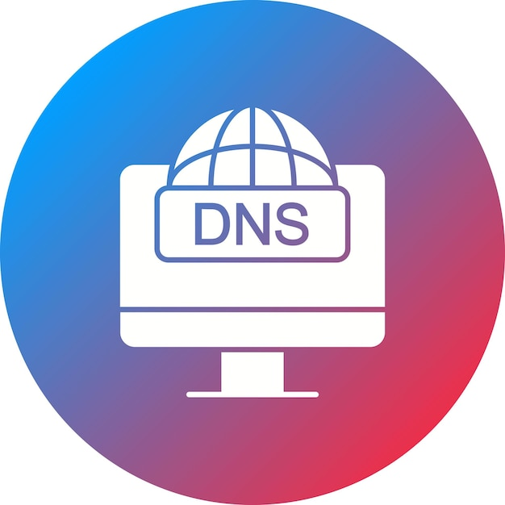

<p align="center">
  
</p>
# 🛡️ DNS Security Server 🚀

A high-performance multi-threaded DNS Security Server built in Python with advanced features like domain blocking, DNS caching, local DNS resolution, upstream forwarding, audit logging, heuristic threat detection, and system-wide DNS integration.

💼 Developed as part of internship work at **OFDC**.

---

# ✨ Features

✅ Multi-threaded DNS server  
✅ DNS request forwarding  
✅ DNS response caching with TTL expiration  
✅ Local DNS record resolution  
✅ Domain blocklist filtering  
✅ Wildcard and subdomain blocking  
✅ Threat heuristic detection  
✅ Structured JSON security logging  
✅ System-wide DNS testing support  
✅ Concurrent client handling  
✅ Automatic cache cleanup  
✅ DNS packet parsing  
✅ NXDOMAIN response generation  
✅ Real-time monitoring through terminal logs  

---

# 🧠 Technologies Used

| Technology | Purpose |
|---|---|
| 🐍 Python 3 | Core Development |
| 🌐 Socket Programming | Network Communication |
| ⚡ Multithreading | Concurrent Request Handling |
| 📡 DNS Protocol | DNS Packet Processing |
| 📁 JSON Logging | Security Audit Logs |
| 🔄 ThreadPoolExecutor | Parallel Query Processing |

---

# 🏗️ Project Architecture

```text
                    ┌──────────────────┐
                    │   💻 Client PC   │
                    └────────┬─────────┘
                             │
                             ▼
                ┌────────────────────────┐
                │ 🛡️ DNS Security Server │
                └────────┬───────────────┘
                         │
        ┌────────────────┼────────────────┐
        │                │                │
        ▼                ▼                ▼
 ┌─────────────┐  ┌─────────────┐  ┌─────────────┐
 │ 🚫 Blocklist│  │ ⚡ DNS Cache│  │ 🏠 Local DNS│
 │   Filter    │  │   Engine    │  │   Records   │
 └─────────────┘  └─────────────┘  └─────────────┘
                         │
                         ▼
               ┌─────────────────┐
               │ ☁️ Cloudflare DNS│
               │     1.1.1.1     │
               └─────────────────┘
```

---

# ⚙️ Working Flow

```text
1️⃣ Client sends DNS request
2️⃣ Domain is decoded
3️⃣ Blocklist filtering is performed
4️⃣ Threat heuristics are checked
5️⃣ Local DNS records are checked
6️⃣ Cache lookup is performed
7️⃣ Query forwarded to upstream DNS if needed
8️⃣ Response cached with TTL
9️⃣ DNS response returned to client
🔟 Security logs generated
```

---

# 🔍 Threat Detection Features

The server performs heuristic-based analysis on suspicious domains.

### 🚨 Current Heuristics

- Suspiciously long domains
- Excessive hyphen usage
- High-risk TLD detection

### Example

```text
aaaaaaaaaaaaaaaaaaaaaaaaaaaaaaaaaaaaaaaaaaaaaaaaaaaaaaaaaaaaaaa.com
```

can be automatically flagged as suspicious.

---

# 📂 Project Structure

```text
DNS-Security-Server/
│
├── 📄 dns_server.py
├── ⚙️ config.json
├── 🚫 blocklist.txt
├── 📜 dns_security_audit.log
├── 📘 README.md
```

---

# ⚙️ Configuration

## 📄 config.json

```json
{
    "upstream_dns_ip": "1.1.1.1",
    "upstream_dns_port": 53,
    "listen_port": 53,

    "blocklist_file": "blocklist.txt",

    "local_records": {
        "example.local": "192.168.1.100",
        "dev.local": "127.0.0.1",
        "internbox.test": "10.0.0.99"
    }
}
```

---

# 🚫 Blocklist Configuration

## 📄 blocklist.txt

```text
facebook.com
instagram.com
fbcdn.net
cdninstagram.com
doubleclick.net
malware-palace.biz
unauthorized-site.com
phishing-login-test.org
```

### ✅ Supports

- Exact domain blocking
- Wildcard subdomain blocking

### Automatically Blocks

```text
www.facebook.com
graph.instagram.com
static.xx.fbcdn.net
edge-chat.facebook.com
```

---

# 📥 Installation

## 🔽 Clone Repository

```bash
git clone https://github.com/YOUR_USERNAME/DNS-Security-Server.git
```

```bash
cd DNS-Security-Server
```

---

# 📋 Requirements

✅ Python 3.9+  
✅ Administrator/root privileges  
✅ Internet connection  

⚠️ No external Python libraries are required.

---

# ▶️ How To Run

## 🪟 Windows

Open **Command Prompt as Administrator**.

Run:

```bash
python dns_server.py
```

---

## 🐧 Linux / 🍎 macOS

```bash
sudo python3 dns_server.py
```

---

# 🖥️ Expected Startup Output

```text
[*] Loaded 8 blocked domains.
[*] DNS Server listening on 0.0.0.0:53
```

---

# 🌍 System-Wide DNS Testing

## 🪟 Windows Setup

Go to:

```text
Control Panel
→ Network and Internet
→ Network and Sharing Center
→ Change adapter settings
```

Select your network adapter.

Open:

```text
Properties
→ Internet Protocol Version 4 (TCP/IPv4)
```

Set DNS manually:

| Field | Value |
|---|---|
| Preferred DNS | 127.0.0.1 |

Click OK.

---

# 🧹 Flush DNS Cache

Open CMD as Administrator:

```bash
ipconfig /flushdns
```

---

# 🌐 Chrome DNS Cache Cleanup

Open:

```text
chrome://net-internals/#dns
```

Click:

```text
Clear host cache
```

Then open:

```text
chrome://net-internals/#sockets
```

Click:

```text
Flush socket pools
```

---

# 🧪 Testing

## 🏠 Test Local DNS Records

```bash
nslookup example.local 127.0.0.1
```

Expected:

```text
example.local    A    192.168.1.100
```

---

## 🚫 Test Blocked Domains

```bash
nslookup facebook.com 127.0.0.1
```

Expected:

✅ NXDOMAIN response  
✅ Domain blocked in logs  

---

## 🌐 Test DNS Forwarding

```bash
nslookup google.com 127.0.0.1
```

Expected:

✅ Request forwarded to Cloudflare DNS  
✅ Response cached  

---

## ⚡ Test DNS Cache

Run multiple times:

```bash
nslookup google.com 127.0.0.1
```

Expected:

```text
[CACHE HIT] google.com
```

---

# 🖥️ Example Console Logs

```text
[QUERY] google.com from 127.0.0.1
[FORWARD] google.com
[CACHE STORE] google.com -> 142.250.183.206

[QUERY] www.facebook.com from 127.0.0.1
[BLOCKED] www.facebook.com

[QUERY] google.com from 127.0.0.1
[CACHE HIT] google.com
```

---

# 📜 Security Audit Logs

All security events are logged in structured JSON format.

### Example

```json
{
    "event_type": "DNS_BLOCK",
    "severity": "CRITICAL",
    "domain": "facebook.com",
    "action": "BLOCK",
    "outcome": "NXDOMAIN"
}
```

---

# ⚡ Performance Features

✅ Multi-threaded request handling  
✅ DNS response caching  
✅ Automatic cache cleanup  
✅ Concurrent client support  
✅ Fast local resolution  
✅ Reduced upstream DNS load  

---

# ⚠️ Current Limitations

❌ No DNSSEC validation  
❌ No DNS-over-HTTPS support  
❌ IPv4 only  
❌ No rate limiting  
❌ No web dashboard  

---

# 🚀 Future Improvements

- 🔐 DNS-over-HTTPS (DoH)
- 🛡️ DNSSEC validation
- 🌐 IPv6 support
- 📊 Web dashboard
- 🗄️ SQLite logging
- 📈 Prometheus metrics
- 🤖 AI-based anomaly detection
- 🚨 Rate limiting
- 🌍 GeoIP filtering

---

# 📚 Learning Outcomes

This project demonstrates practical understanding of:

✅ Socket Programming  
✅ DNS Protocol Internals  
✅ Network Security  
✅ Concurrent Programming  
✅ Packet Parsing  
✅ Threat Detection  
✅ System-Level Networking  
✅ Security Logging  
✅ Cache Management  

---

# 💡 Use Cases

- 🛡️ DNS filtering
- 🚫 Malware domain blocking
- 📢 Ad blocking
- 🏠 Local network DNS server
- 🔬 Cybersecurity learning
- 🏢 Enterprise DNS monitoring
- 🧪 Security research

---

# 💼 Internship Information

📌 This project was developed as part of internship work at **OFDC**.

---

# 👨‍💻 Author

### YOUR_NAME

🎓 AI & Robotics Engineering Student  
💻 Python Developer  
🌐 Networking Enthusiast  
🛡️ Cybersecurity Learner  

---

# ⭐ If You Like This Project

Give this repository a ⭐ on GitHub.

---

# 📄 License

This project is intended for educational and research purposes.

---
